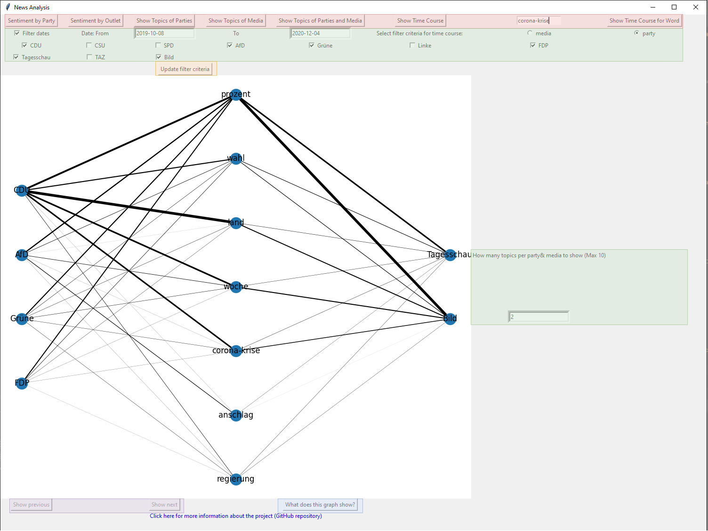
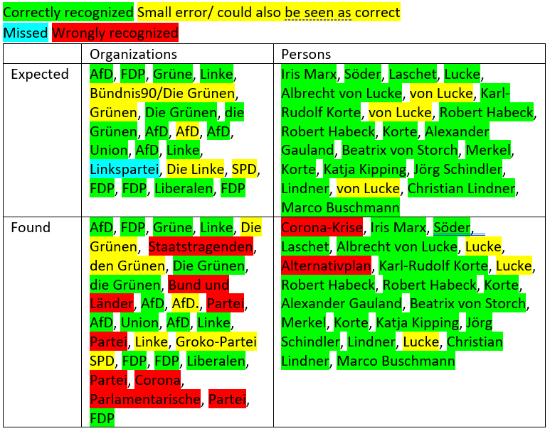
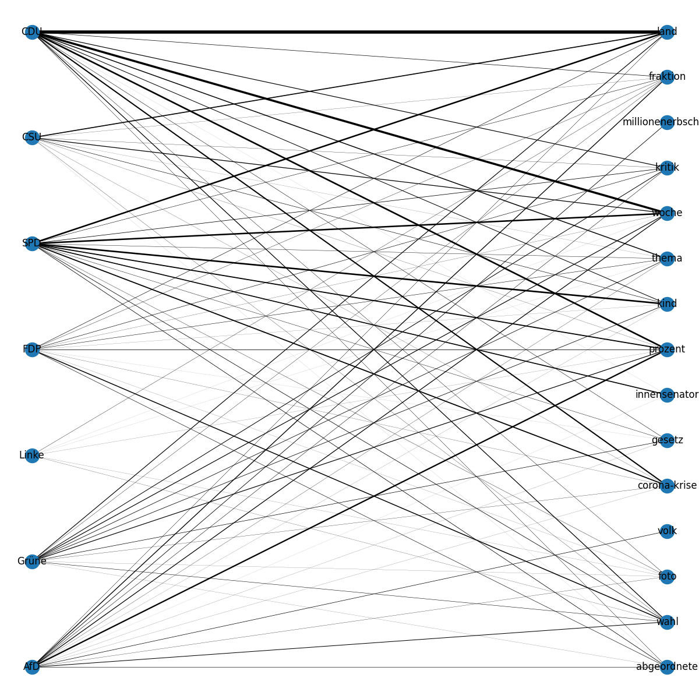
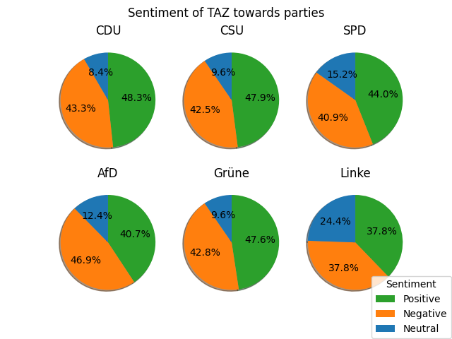
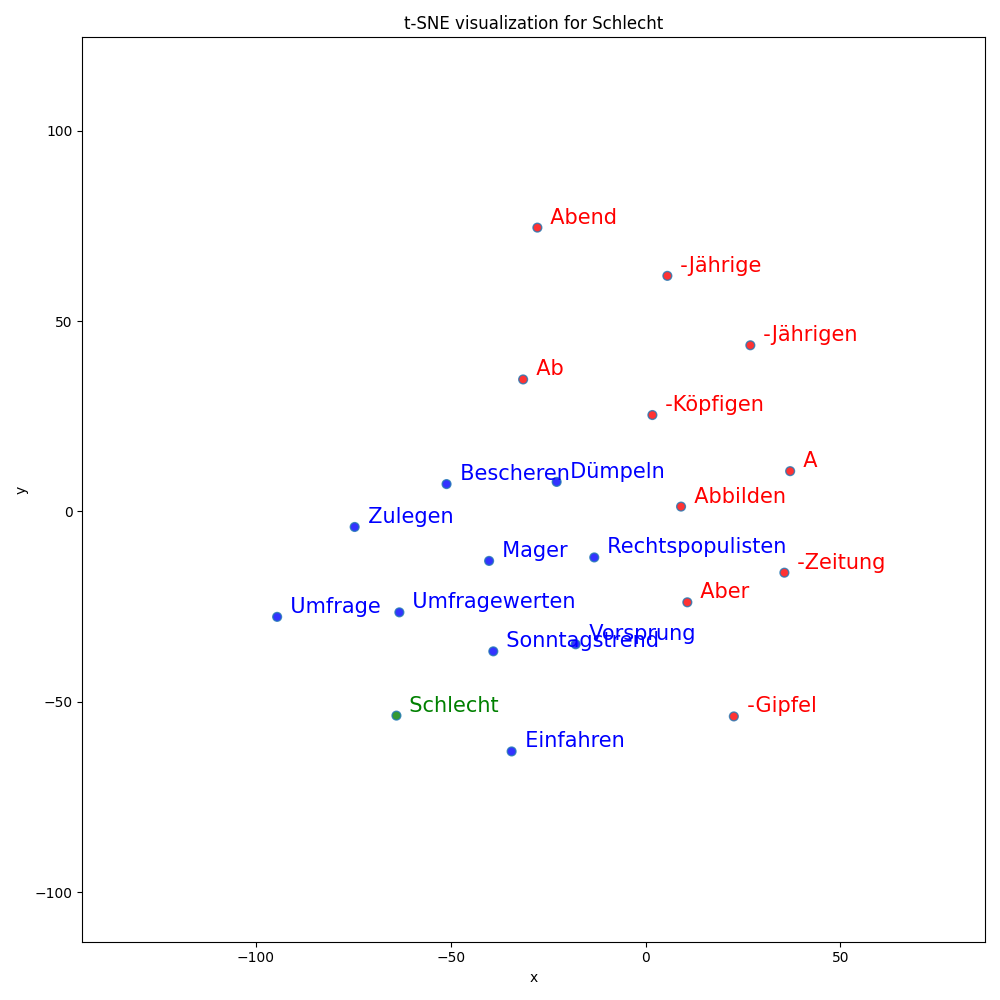

# Sentiment Analysis of News Articles Towards Different German Parties

## Team Members
Kim-Celine Kahl  
ei260@stud.uni-heidelberg.de  

Miguel Heidegger  
tf268@stud.uni-heidelberg.de

Sophia Matthis  
cq270@stud.uni-heidelberg.de

## Setup

1. [Install](https://pipenv.pypa.io/en/latest/#install-pipenv-today) ```pipenv```. You might want to set ```export PIPENV_VENV_IN_PROJECT=1``` in your ```.bashrc/.zshrc``` for local virtual environments. Thereby you are making sure that all dependencies for your application are stored in the same directory under the `.venv` folder.  

2. Clone repository into preferred directory (or simply download the source code and rename the folder as you like): `git clone https://github.com/yakuhzi/news-analysis`  

3. Install packages: `cd news-analysis && pipenv install --dev`  

4. Init ```.env``` file. Use this file to store all your environment variables, such as credentials or encryption phrases. This file should never be added to your public repository but should always stay local.

5. Activate virtual environment: `pipenv shell`  

6. Test setup: `pipenv run main`  (more about typical ways to run the program are shown in the section [below](#run-the-program-in-different-modes))

7. Install Git hooks: `pre-commit install`


## Testing

A script to automatically execute tests is already defined in the project's `Pipfile`. Therefore you can simply run: `pipenv run test`
To generate a report on code coverage alongside run: `pipenv run test && pipenv run report`

## Run the program in different modes
Here are typical use cases how you might want to run the program:
1. I want to see the results for sentiment and topics in the GUI
    ```
   pipenv run main -g
    ```
   __WARNING:__ If you have not started the program before, the processing of the whole dataframe is performed, which takes ~2-3 hours. If you want to see the results of a smaller subset of the data you can limit the amount by
   ```
   pipenv run main -g -n 1000
   ```
   In this example, only 1000 articles are read in and processed
2. I want to force the processing again and store the results of the new processing (because I want to use a different number of articles/ a different dataset)
    ```
   pipenv run main -f -w
    ```
   If you don't use -w, the changes of the processing are only persistent for the current program run and do not overwrite your existing processed datasets
   
3. I want to label data
    ```
   pipenv run main -l 0-100
    ```
   In this example, the first 100 articles are outputted to the console for labeling. You can change the range of articles by specifying different \<start\>-\<end\>.\
   The result of the labeling is stored in a file named "labeled_paragraphs.json".\
   For more information about how to label paragraphs, see [Labeling Data](#labeling-data)
  
4. I want to train the sentiment threshold
    ```
   pipenv run main -t
    ```
   Note that you need a labeled dataset to train the threshold. After training, the "labeled_paragraphs.json" and "paragraphs.json" are overwritten with the new sentiment labels determined with the optimized threshold.
   
4. I want to evaluate the results
    ```
   pipenv run main -c
    ```
   Note that you need a labeled dataset to evaluate the results.


Of course the command line arguments can also be used in different combinations than the use cases explained above. For an overview of possible command line arguments with description enter
```
pipenv run main -h
```

## Using the GUI
This section describes how you can use the GUI (command line argument -g).\
For explanation, some parts in the GUI are overlayed with a colored box in the screenshot below.

In the colored boxes you can see the following:
* Red: these are the different types of graphs you can show. 
  By pressing one of the buttons, the respective graph is shown in the center of the screen. 
  In this example, the graph for "Show Topics of Parties and Media" is shown. 
  To display the "Show Time Course for Word", you have to specify the word of which you want to see the frequency in the text box on the left hand side (here: "corona-krise")
* Green: These are different filter criteria to select certain data of interest for you. 
  For specifying a time range, you need to enable the "Filter dates" checkbox and type in a date in the format "YYYY-MM-DD". 
  Note that the option "How many topics per party& media to show (Max 10)" is only available for "Show Topics per Party", "Show Topics per Media" and "Show Topics per Party and Media"
* Orange: If you changed one of the filter criteria and want to update the graph in the middle, you need to click "Update filter criteria".
* Purple: For some types of graphs, there are multiple graphs which can be viewed one after the other in the GUI ("Sentiment by Party", "Sentiment by Outlet", "Show Time Course").
  You can navigate through them with "Show previous" or "Show next".
* Blue: if you click on this button, additional information what can be seen on this graph is shown as a text in a pop up window.

## Labeling Data
This section describes how you can label data if you run the program in labeling mode (command line argument -l \<start\>-\<end\>).

For each article you can see the following output in the console.\
================================================\
\<Title of the article\>\
++++++++++++++++++++++++++++++++++++++++++++++++\
\<one paragraph of the article\>

Note that for all articles the tagged persons and parties are anonymized by "\<Person\>" or "\<Partei\>" to not influence your rating based on what party/ person the article is about.

Just type in the console which Polarity (-1: Negative, 0: Neutral, 1: Positive) you think is stated towards the party. 
After pressing enter type in if you think the paragraph is subjective or objective (0: Objective, 1: Subjective).
After pressing enter again, the next paragraph appears.

## Planning State

| Description                                      | Milestone          | Deadline   | Started  | Achieved | 
|--------------------------------------------------|--------------------|------------|----------|----------|
| Project Idea                                     | Proposal           | 27.11.2020 | X        | X        |
| Initial Research                                 | Proposal           | 27.11.2020 | X        | X        |
| Proposal Report                                  | Proposal           | 27.11.2020 | X        | X        |
|                                                  |                    |            |          |          |
| Repository Setup                                 | December Milestone	| 18.02.2020 | X        | X        |
| Alignment Meeting with Mentor                    | December Milestone	| 18.02.2020 | X        | X        |
| Dataset Analysis                                 | December Milestone | 18.02.2020 | X        | X        |
| Dataset Statistics                               | December Milestone | 18.02.2020 | X        | X        |
| Preprocessing Pipeline                           | December Milestone | 18.02.2020 | X        | X        |
| Topic Detection                                  | December Milestone | 18.02.2020 | X        | X        |
| Milestone README                                 | December Milestone | 18.02.2020 | X        | X        |
|                                                  |                    |            |          |          |
| Negation Handling                                | Final Report       | February   | X        | X        |
| Incorporate SentiWS (Sentiment Lexicon)          | Final Report       | February   | X        | X        |
| Sentiment Calculation                            | Final Report       | February   | X        | X        |
| Sentiment Visualization                          | Final Report       | February   | X        | X        |
| Sentiment Threshold                              | Final Report       | February   | X        | X        |
| Filter Options                                   | Final Report       | February   | X        | X        |
| Dimension Analysis                               | Final Report       | February   | X        | X        |
| Final Codebase                                   | Final Report       | February   | X        | -        |
| Final README                                     | Final Report       | February   | X        | -        |
| Final Report                                     | Final Report       | 15.03.2021 | X        | -        |
|                                                  |                    |            |          |          |
| Project Video                                    | Presentation       | 25.02.2021 | X        | -        |

### Data Sources 
As data sources, around 100.000 german news articles from three different news agencies are used. those are namely:
* Bild: 75826 articles
* Tagesschau: 12284 articles 
* TAZ: 13401 articles

With [NER tagging](#ner-tagging), the data was filtered such that only articles which deal with a German political party remain. 
After this filtering, the ratio between all articles and articles of interest looks the following:


To visualize the ratio between the individual agencies a bit better, the following charts show the ration for each agency

 Ratio between all articles and articles of interest: 8514/75826 = 11.23%

Ratio between all articles and articles of interest: 2373/12284 = 19.32%

Ratio between all articles and articles of interest: 3468/13401 = 25.88%

Overall the ratio of articles of interest (those which deal with parties) looks the following


Overall, we found 14355 articles of interest.

Although "Bild" hs the lowest ratio of articles of interest / articles, the Bild articles make up nearly 60% when only looking only at the 
articles of interest. This is of cause caused by the significantly higher amount of "Bild" articles overall. 

### Preprocessing
Before the data can be processed any further, it needs to be preprocessed. The challenge hereby was to choose preprocessing methods that keep enough information to determine the objectivity (sentiment analysis) later on.
For this reason the pipeline, which is described in the following, was created.
* lowercasing the text
    The first step is to lowercase the text. This ensures that the text is more uniform, which might be beneficial following processing steps. As of now there is a hunch that the later described NER Tagging potentially performs better without lowercasing. This has to be evaluated further and is decided to a later point in time.
* removing special characters
    Secondly some characters that are unimportant for further processing need to be removed. 
    The original JSON files containing the articles have the characters "\n" to indicate a linebreak. This is unneccessary for processing the data and needs to be removed. 
    Additionally with the help of regex, letters from "a-z", numbers from "0-9", the hyphen as well as the - in German commonly used - umlauts ("ä", "ö", "ü") are kept. Everything else is removed from the text. In further steps of the projects this might need to be reconsidered, maybe the use of punctuation marks (e.g.: exclamation marks) provide information about the objectivity.
* remove stopwords
    For the time beeing the stop words are removed from the text. Nontheless it has to be evaluated in the future, whether the these frequently used words are helping on determining the objectivity of the text. For example the phrase "opel fährt auf transporter auf" is transformed into "opel fährt transporter", which has a totally different meaning. The impact of this still needs to be figured out.

The following steps are done by using the library spaCy. It provides a preprocessing pipeline wich is run when npl is called on a defined text.
* tokenization
    This is the first step of the processing pipeline. It segments the specified text into tokens 
* POS tagging
    This is the second part of the processing pipeline of spaCy. It assigns part-of-speech tags to the aforementioned tokens.
* NET Tagging
    Since parts of the processing pipeline are deactivated, this is the next step. It is explained in more detail later on.
* lemmatization
    Lastly lemmatization is done. The words (tokens) of the text are saved in their respective base form. This was preferred before stemming, since the sentiment analysis could be done by using a sentiment lexicon that weights words by their positive or negative indication. 


For each data source the end result of the preprocessing is then stored in a seperate JSON-file called "source_preprocessed.json". Additionally to the original columns it now also has a column for the NER tagging (see following chapter), POS tagging and lemmatization.
The JSON object is then structured as follows:

```json
[
  {
    "title": "text",
    "text": "text",
    "summary": "text",
    "date": "date as text",
    "authors": null,
    "references": [],
    "persons": [
      "Person 1 in text",
      "Person 2 in text"
    ],
    "organizations": [
      "Organization 1 in text",
      "Organization 2 in text"
    ],
    "pos_tags": ["token", "POS-Tag"], 
    "lemma":["text"]
  }  
]
```

#### NER Tagging 
As one of the first parts of the project, NER tagging was performed in order to find political parties and members of
the parties to identify relevant articles in the data set. For NER tagging, spacy is used with the 
[de_core_news_lg language model](https://spacy.io/models/de#de_core_news_lg), which has the best score for NER tagging
compared to the other German language models provided by spacy.

Results of the NER tagging:

To get a first insight how good the NER tagging performs, the first 100 articles of each agency were tagged.
Overall, the NER tagging performs quite okay, especially it is good in recognizing different parties.

Here is one example of the Tagesschau data set (article at index 4):



**SUMMARY:** NER tagging with spacy and german language model does not work perfectly, but quite good and good enough 
for a first filtering of the text to recognize in which text political parties/ actors are mentioned at all.

### Topic Detection
As discussed in the first alignment meeting with our advisor, we want to apply topic detection on our preprocessed articles to be able to compare the sentiment not only across parties, but also across different topics the journalists are talking about. This should give us the oppurtunity to filter out some bias if e.g. a news publisher is focused on specific topics like e.g. the natural environment and therefore is generally more critically against parties that have a different point of view about this topic.

For the implementation of the topic detection we used the library `gensim`. We created a class `TopicDetection` that does handle all the tasks of topic detection. It can calculate the TF-IDF scores and the document similarity of a given corpus. Also we implemented three different methods that return `gensim` models of the `Latent Semantic Analysis (LSA)`, `Latent Dirichlet Allocation (LDA)` and `Hierarchical Dirichlet Process (HDP)`, that can be applied on our data to gather the most important topics. We used different models to calculate the topics, as we wanted to compare the results of each method to choose the best performing one.

As a measure of quality for the topics, we calculated the coherence score. As `LSA` and `LDA` are depending on the number of topics as a parameter, we implemented a method called `plot_coherence_scores()` that test empirically which number of topics results in the best coherence score.

Another method of analysing the quality of the topics is using a visual representation of the topics with `pyLDAvis`. Therefore the method `visualize_topics()` of the TopicDetection class can be used.

#### Results
  
The figure above shows that the coherence score of LDA is increasing almost linearly with the number of topics. This is not ideal, as we want to cluster the topics of multiple articles and not create a topic per article. To improve the performance, we may need to improve the preprocessing and also make further analysis on how to adjust the parameters of the models.  

  
Also the visual representation of the LDA topics shows that the topics are not chosen perfectly. There is no real clustering as multiple unrelated topics are merged together (e.g. sonneborn and mordkommision).

Although the figures above only show results from LDA, the results of the other methods are fairly similar. We have chosen `HDP` as another option for topic modeling, because it determines the number of topics automatically and no parameter for this has to be provided. But using this model, far too many topics are generated and almost no generalization of similar topics are made.

We also tried to cluster the topics using Hierarchical Agglomerative Clustering, but without much success. The following figure shows how the Dendrogram, that should help to find the optimal numbers of clusters. Normally the best choice of number of clusters should be where the largest vertical distance doesn't intersect any of the clusters. Here this is the case before any clusters are merged. Therefore, the number of optimal clusters should be equal to the number of articles. Obviously this is not what we want.

  

To overcome this issues, we need to further investigate why our documents can't be grouped that easy by a topic. As already mentioned, we need to further finetune the preprocessed data and the parameters of some models or maybe look at a completely different approach.

### Keyword Extraction
As the results of the topic detections are not as good as expected, a basic keyword extraction was done using TF-IDF scores. For each party the top three words are taken, and the count of each word occurrence in the paragraphs is counted. The results are shown in the following bipartite graph:  

  

### Sentiment Analysis
For the sentiment analysis, each word of a paragraph was weighted by a sentiment score from SentiWS. Also the TF-IDF score of each word was calculated. By performing the dot product of the sentiment score, and the TF-IDF scores, the overall sentiment of a sentence was calculated. 

#### Visualization
The following image shows the sentiment towards the parties in the articles of the news agency TAZ.

  


#### Sentiment Clustering
Instead of using SentiWS to calculate the sentiment scores of each word, we tried also to perform a clustering of the sentiment to get more accurate results. But as you can see in the following image, the clusters are not towards a sentiment and thus cannot be used for our task.

  
