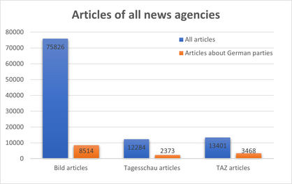
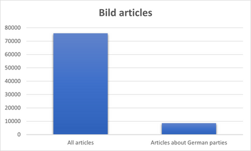
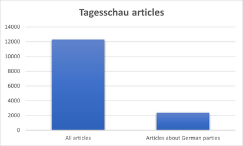
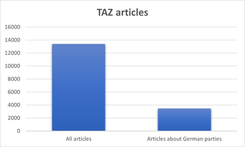
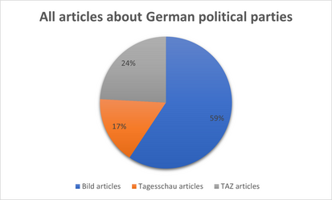
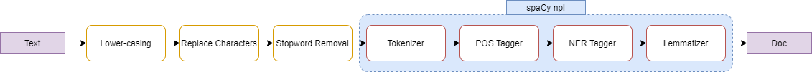
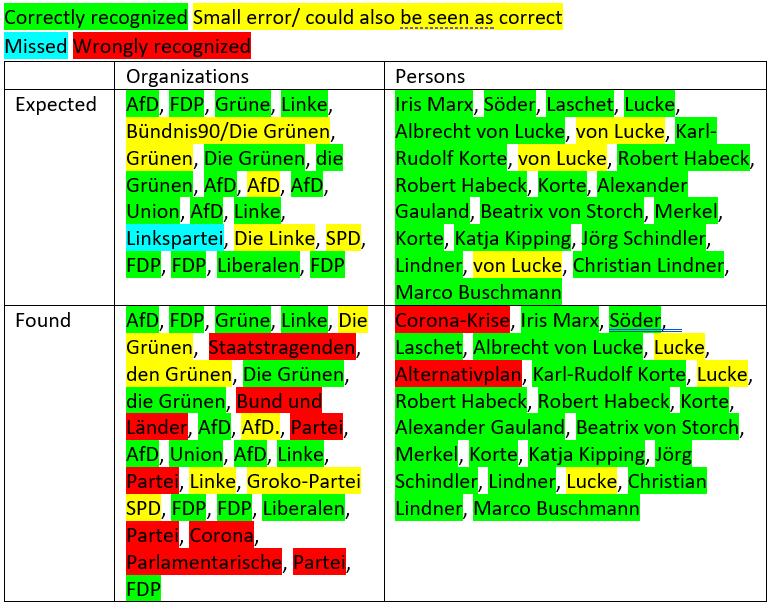
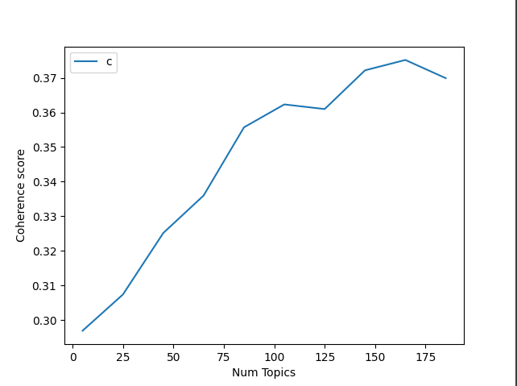
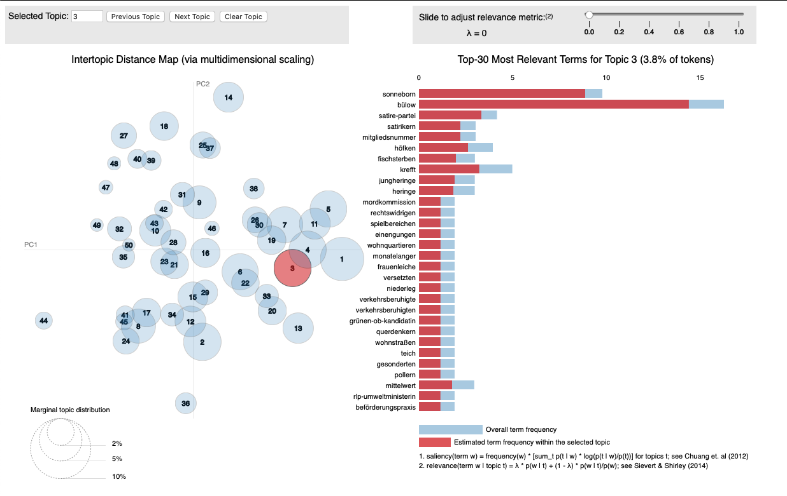
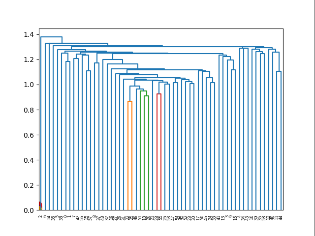

# Sentiment Analysis of News Articles Towards Different German Parties

## Team Members
Kim-Celine Kahl  
ei260@stud.uni-heidelberg.de  

Miguel Heidegger  
tf268@stud.uni-heidelberg.de

Sophia Matthis  
cq270@stud.uni-heidelberg.de

## Setup

1. [Install](https://pipenv.pypa.io/en/latest/#install-pipenv-today) ```pipenv```. You might want to set ```export PIPENV_VENV_IN_PROJECT=1``` in your ```.bashrc/.zshrc``` for local virtual environments. Thereby you are making sure that all dependencies for your application are stored in the same directory under the `.venv` folder.  

2. Clone repository into preferred directory (or simply download the source code and rename the folder as you like): `git clone https://github.com/yakuhzi/news-analysis`  

3. Install packages: `cd news-analysis && pipenv install --dev`  

4. Init ```.env``` file. Use this file to store all your environment variables, such as credentials or encryption phrases. This file should never be added to your public repository but should always stay local.

5. Activate virtual environment: `pipenv shell`  

6. Test setup: `pipenv run main`  

7. Install Git hooks: `pre-commit install`


## Testing

A script to automatically execute tests is already defined in the project's `Pipfile`. Therefore you can simply run: `pipenv run test`
To generate a report on code coverage alongside run: `pipenv run test && pipenv run report`

## Milestone

### Feedback from the first meeting with mentor
The key points from the first meeting with our mentor were that overall the project idea is good. However,
in our initial report we did not consider the fact that also different topics of the articles might affect the sentiment,
e.g. if a news paper writes a lot about renewable energies, car lobby, etc.

This is why we also want to consider the topics for the sentiment analysis.

Also, through the discussion we gained some information about which data to use. There is already an existing data set
from the university which is provided for this project. Details about the data are described in the section 
[Data Sources](#data-sources).

### Planning State

| Description                                      | Milestone          | Deadline   | Started  | Achieved | 
|--------------------------------------------------|--------------------|------------|----------|----------|
| Project Idea                                     | Proposal           | 27.11.2020 | X        | X        |
| Initial Research                                 | Proposal           | 27.11.2020 | X        | X        |
| Proposal Report                                  | Proposal           | 27.11.2020 | X        | X        |
|                                                  |                    |            |          |          |
| Repository Setup                                 | December Milestone	| 18.02.2020 | X        | X        |
| Alignment Meeting with Mentor                    | December Milestone	| 18.02.2020 | X        | X        |
| Dataset Analysis                                 | December Milestone | 18.02.2020 | X        | X        |
| Dataset Statistics                               | December Milestone | 18.02.2020 | X        | X        |
| Preprocessing Pipeline                           | December Milestone | 18.02.2020 | X        | X        |
| Topic Detection                                  | December Milestone | 18.02.2020 | X        | -        |
| Milestone README                                 | December Milestone | 18.02.2020 | X        | X        |
|                                                  |                    |            |          |          |
| Sentiment Analysis                               | Final Report       | February   | X        | -        |
| Incorporate SentiWS (Sentiment Lexicon)          | Final Report       | February   | X        | X        |
| Finding Features for corpus-based approach       | Final Report       | February   | -        | -        |
| Final Codebase                                   | Final Report       | February   | -        | -        |
| Final README                                     | Final Report       | February   | -        | -        |
| Final Report                                     | Final Report       | 15.03.2021 | -        | -        |
|                                                  |                    |            |          |          |
| Project Video                                    | Presentation       | 25.02.2021 | -        | -        |

### Data Sources 
As data sources, around 100.000 german news articles from three different news agencies are used. those are namely:
* Bild: 75826 articles
* Tagesschau: 12284 articles 
* TAZ: 13401 articles

With [NER tagging](#ner-tagging), the data was filtered such that only articles which deal with a German political party remain. 
After this filtering, the ratio between all articles and articles of interest looks the following:



To visualize the ratio between the individual agencies a bit better, the following charts show the ration for each agency

 Ratio between all articles and articles of interest: 8514/75826 = 11.23%

Ratio between all articles and articles of interest: 2373/12284 = 19.32%

Ratio between all articles and articles of interest: 3468/13401 = 25.88%

Overall the ratio of articles of interest (those which deal with parties) looks the following



Overall, we found 14355 articles of interest.

Although "Bild" hs the lowest ratio of articles of interest / articles, the Bild articles make up nearly 60% when only looking only at the 
articles of interest. This is of cause caused by the significantly higher amount of "Bild" articles overall. 

### Preprocessing
Before the data can be processed any further, it needs to be preprocessed. The challenge hereby was to choose preprocessing methods that keep enough information to determine the objectivity (sentiment analysis) later on.
For this reason the pipeline, which is described in the following, was created.
* lowercasing the text
    The first step is to lowercase the text. This ensures that the text is more uniform, which might be beneficial following processing steps. As of now there is a hunch that the later described NER Tagging potentially performs better without lowercasing. This has to be evaluated further and is decided to a later point in time.
* removing special characters
    Secondly some characters that are unimportant for further processing need to be removed. 
    The original JSON files containing the articles have the characters "\n" to indicate a linebreak. This is unneccessary for processing the data and needs to be removed. 
    Additionally with the help of regex, letters from "a-z", numbers from "0-9", the hyphen as well as the - in German commonly used - umlauts ("ä", "ö", "ü") are kept. Everything else is removed from the text. In further steps of the projects this might need to be reconsidered, maybe the use of punctuation marks (e.g.: exclamation marks) provide information about the objectivity.
* remove stopwords
    For the time beeing the stop words are removed from the text. Nontheless it has to be evaluated in the future, whether the these frequently used words are helping on determining the objectivity of the text. For example the phrase "opel fährt auf transporter auf" is transformed into "opel fährt transporter", which has a totally different meaning. The impact of this still needs to be figured out.

The following steps are done by using the library spaCy. It provides a preprocessing pipeline wich is run when npl is called on a defined text.
* tokenization
    This is the first step of the processing pipeline. It segments the specified text into tokens 
* POS tagging
    This is the second part of the processing pipeline of spaCy. It assigns part-of-speech tags to the aforementioned tokens.
* NET Tagging
    Since parts of the processing pipeline are deactivated, this is the next step. It is explained in more detail later on.
* lemmatization
    Lastly lemmatization is done. The words (tokens) of the text are saved in their respective base form. This was preferred before stemming, since the sentiment analysis could be done by using a sentiment lexicon that weights words by their positive or negative indication. 



For each data source the end result of the preprocessing is then stored in a seperate JSON-file called "source_preprocessed.json". Additionally to the original columns it now also has a column for the NER tagging (see following chapter), POS tagging and lemmatization.
The JSON object is then structured as follows:

```json
[
  {
    "title": "text",
    "text": "text",
    "summary": "text",
    "date": "date as text",
    "authors": null,
    "references": [],
    "persons_ner": [
      "Person 1 in text",
      "Person 2 in text"
    ],
    "organizations_ner": [
      "Organization 1 in text",
      "Organization 2 in text"
    ],
    "pos_tags": ["token", "POS-Tag"], 
    "lemma":["text"]
  }  
]
```

### NER Tagging 
As one of the first parts of the project, NER tagging was performed in order to find political parties and members of
the parties to identify relevant articles in the data set. For NER tagging, spacy is used with the 
[de_core_news_lg language model](https://spacy.io/models/de#de_core_news_lg), which has the best score for NER tagging
compared to the other German language models provided by spacy.

Results of the NER tagging:

To get a first insight how good the NER tagging performs, the first 100 articles of each agency were tagged.
Overall, the NER tagging performs quite okay, especially it is good in recognizing different parties.

Here is one example of the Tagesschau data set (article at index 4):



* Organizations
    * Many correctly recognized → especially things like Union, Liberale very good (not “actual” name of party/ 
    different naming as usual)
    * Only one missed
    * Some differences in classification with/ without article for the party, not directly false
    * False classified: “Partei” occurs often, might be related to the German party 
    “Die Partei” → difficult case, 
    “Corona” might occur because it was most likely not in the training set of the German language model
* Persons
    * Almost everything correct → in “von Lucke” only “Lucke was recognized 
    (hard case, because “von” is a regular German word, in most cases not associated with names)
    * Again “Corona-Krise” was most likely not in training set of language model


Other general findings after a first insight into the tagged data were:
* In general, (most likely) not known words are often recognized as organizations → problems with longer 
expressions and expressions with hyphens
    * Examples Bild
        * 90-Liter-Kompressorkühlschrank
        * Drei Leasing-Schnäppchen
        * Hybrid-PKW
        * CO2-Grenzen
        * 310-PS-Antrieb
    * Examples Tagsschau
        * Antarktis-Durchquerung
        * Ex-Präsident
        * Corona-Pandemie
        * CSU-euphorische Bierzeltstimmung
    * Examples TAZ
        * Corona
        * Schlusslicht
        * Bund und Ländern
        * Sechs-Monats-Frist
        * +++ Corona News
        * Sars-CoV-2
* Seems like persons are more often recognized correctly, but also some outliers where not clear pattern is 
recognizable why they are tagged as persons (assumption: most likely also words that are not known from 
training the model)
    * Examples Bild
        * Luxus-Limo
        * Preisschock
        * Dranhalten
        * Blitzmarathons
    * Examples Tagesschau
        * Verheerende Buschfeuer
        * Gestrichene
    * Examples TAZ
        * Zopfstränge
        * Backwettbewerbe
        * Coronatests
        * Selbstisolation
* For persons, sometimes “role” is also tagged, sometimes not
    * “FDP-Chef Lindner” → tagged “Lindner”
    * „Bundeswirtschaftsminister Altmaier“ → tagged „Bundeswirtschaftsminister Altmaier“
    * „Verkehrsminister Scheuer“ → „Verkehrsminister Scheuer“
    * „FDP-Ausschussmitglied Luksic“ → tagged „FDP-Ausschussmitglied Luksic“
* In very few cases, persons are tagged as organizations (when their name is associated with an organization, 
e.g. as role: WikiLeaks-Gründer Assange) 
* In general, tagesschau and tagging seems to work better than BILD tagging → might be topic related 
(the first 100 articles of taz& tagesschau were mainly about politics, for BILD mainly cars)

**SUMMARY:** NER tagging with spacy and german language model does not work perfectly, but quite good and good enough 
for a first filtering of the text to recognize in which text political parties/ actors are mentioned at all

**UPDATE:** First, NER tagging was treated as a seperate task and not as part of the preprocessing pipeline. After
integrating it into the preprocessing pipeline, it turned out that it performed best when doing it right after removing
all special characters and before lowercasing. From a first insight into the data, it seems like through integrating it
into the preprocessing pipeline directly, some false positives were filtered out (has to be relatet to removal of special
characters) but also more false negatives occured. But overall, the results still look decent.

### Topic Detection
As discussed in the first alignment meeting with our advisor, we want to apply topic detection on our preprocessed articles to be able to compare the sentiment not only across parties, but also across different topics the journalists are talking about. This should give us the oppurtunity to filter out some bias if e.g. a news publisher is focused on specific topics like e.g. the natural environment and therefore is generally more critically against parties that have a different point of view about this topic.

For the implementation of the topic detection we used the library `gensim`. We created a class `TopicDetection` that does handle all the tasks of topic detection. It can calculate the TF-IDF scores and the document similarity of a given corpus. Also we implemented three different methods that return `gensim` models of the `Latent Semantic Analysis (LSA)`, `Latent Dirichlet Allocation (LDA)` and `Hierarchical Dirichlet Process (HDP)`, that can be applied on our data to gather the most important topics. We used different models to calculate the topics, as we wanted to compare the results of each method to choose the best performing one.

As a measure of quality for the topics, we calculated the coherence score. As `LSA` and `LDA` are depending on the number of topics as a parameter, we implemented a method called `plot_coherence_scores()` that test empirically which number of topics results in the best coherence score.

Another method of analysing the quality of the topics is using a visual representation of the topics with `pyLDAvis`. Therefore the method `visualize_topics()` of the TopicDetection class can be used.

### Results
  
The figure above shows that the coherence score of LDA is increasing almost linearly with the number of topics. This is not ideal, as we want to cluster the topics of multiple articles and not create a topic per article. To improve the performance, we may need to improve the preprocessing and also make further analysis on how to adjust the parameters of the models.  

  
Also the visual representation of the LDA topics shows that the topics are not chosen perfectly. There is no real clustering as multiple unrelated topics are merged together (e.g. sonneborn and mordkommision).

Although the figures above only show results from LDA, the results of the other methods are fairly similar. We have chosen `HDP` as another option for topic modeling, because it determines the number of topics automatically and no parameter for this has to be provided. But using this model, far too much topics are generated and almost no generalization of similar topics are made.

We also tried to cluster the topics using Hierarchical Agglomerative Clustering, but without much success. The following figure shows how the Dendrogram, that should help to find the optimal numbers of clusters. Normally the best choice of number of clusters should be where the largest vertical distance doesn't intersect any of the clusters. Here this is the case before any clusters are merged. Therefore, the number of optimal clusters should be equal to the number of articles. Obviously this is not what we want.

  

To overcome this issues, we need to further investigate why our documents can't be grouped that easy by topic. As already mentioned, we need to further finetune the preprocessed data and the parameters of some models or maybe look at a completely different approach.


